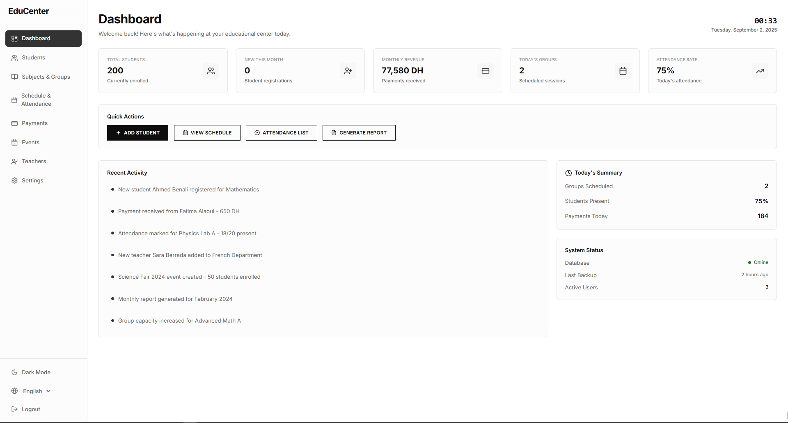

# 🎓 EduCenter - Educational Center Management System

<div align="center">



[](https://reactjs.org/)
[](https://www.typescriptlang.org/)
[](https://vitejs.dev/)
[](https://tailwindcss.com/)
[](https://www.electronjs.org/)
[](LICENSE)

**A modern, comprehensive educational center management system built with React, TypeScript, and Electron**

[🚀 Features](#-features) • [🛠️ Tech Stack](#️-tech-stack) • [📦 Installation](#-installation) • [🚀 Usage](#-usage) • [📱 Screenshots](#-screenshots) • [🤝 Contributing](#-contributing)

</div>

---

## ✨ Features

### 🎯 **Core Management**
- **Student Management** - Complete student lifecycle from registration to graduation
- **Subject & Group Management** - Organize courses, classes, and student groups
- **Teacher Management** - Handle teacher assignments and department organization
- **Schedule & Attendance** - Track class schedules and student attendance
- **Payment Processing** - Manage student fees and payment tracking
- **Event Management** - Organize educational events and activities

### 📊 **Dashboard & Analytics**
- **Real-time Metrics** - Live updates on student count, revenue, and attendance
- **Performance Insights** - Track educational center KPIs and trends
- **Quick Actions** - Streamlined workflows for common tasks
- **Activity Monitoring** - Real-time system status and backup information

### 🎨 **User Experience**
- **Modern UI/UX** - Clean, intuitive interface with brutalist design elements
- **Responsive Design** - Works seamlessly on desktop and mobile devices
- **Dark Mode Support** - Comfortable viewing in any lighting condition
- **Multi-language** - Internationalization support for global users

---

## 🛠️ Tech Stack

| Category | Technology | Version |
|----------|------------|---------|
| **Frontend** | React | 18.x |
| **Language** | TypeScript | 5.x |
| **Build Tool** | Vite | 5.x |
| **Styling** | Tailwind CSS | 3.x |
| **Desktop App** | Electron | 28.x |
| **UI Components** | Custom Component Library | - |
| **State Management** | React Hooks | - |
| **Package Manager** | npm/bun | - |

---

## 📦 Installation

### Prerequisites
- **Node.js** (v18.0.0 or higher)
- **npm** or **bun** package manager
- **Git** for version control

### Quick Start

```bash
# Clone the repository
git clone https://github.com/berserker-glitch/scolink-app.git
cd scolink-app

# Install dependencies
npm install
# or
bun install

# Start development server
npm run dev
# or
bun dev

# Build for production
npm run build
# or
bun run build

# Run Electron app
npm run electron
# or
bun run electron
```

---

## 🚀 Usage

### Web Application
1. **Start Development Server**
   ```bash
   npm run dev
   ```
   Access the application at `http://localhost:5173`

2. **Build for Production**
   ```bash
   npm run build
   ```
   Production files will be generated in the `dist/` directory

### Desktop Application
1. **Run Electron App**
   ```bash
   npm run electron
   ```
   This launches the desktop version of EduCenter

2. **Build Desktop App**
   ```bash
   npm run build:electron
   ```
   Creates distributable packages for different platforms

---

## 📱 Screenshots

### Dashboard Overview


*The main dashboard provides a comprehensive overview of your educational center's operations, including key metrics, quick actions, and recent activity.*

### Key Features
- **📊 Real-time Analytics** - Monitor student enrollment, revenue, and attendance
- **👥 Student Management** - Complete student lifecycle management
- **📚 Subject Organization** - Efficient course and group management
- **💰 Payment Tracking** - Comprehensive financial management
- **📅 Schedule Management** - Organized class scheduling and attendance

---

## 🏗️ Project Structure

```
scolink_application/
├── 📁 src/
│   ├── 📁 components/          # Reusable UI components
│   │   ├── 📁 Layout/         # Layout components
│   │   ├── 📁 Student/        # Student-related components
│   │   ├── 📁 Subject/        # Subject and group components
│   │   └── 📁 ui/             # Base UI components
│   ├── 📁 pages/              # Application pages
│   ├── 📁 hooks/              # Custom React hooks
│   ├── 📁 lib/                # Utility functions
│   ├── 📁 types/              # TypeScript type definitions
│   └── 📁 data/               # Mock data and data models
├── 📁 electron/                # Electron main process files
├── 📁 public/                  # Static assets
└── 📁 dist/                    # Build output
```

---

## 🎨 Component Architecture

### Design System
- **Brutalist Design** - Modern, bold UI components
- **Consistent Spacing** - Unified spacing system using Tailwind CSS
- **Accessibility** - WCAG compliant components
- **Responsive Grid** - Flexible layout system

### Key Components
- **Layout Components** - MainLayout, Sidebar, Navigation
- **Student Components** - AddStudentWizard, StudentDrawer, PaymentModal
- **Subject Components** - GroupDetailDrawer, SubjectDetailDrawer
- **UI Components** - Custom buttons, forms, modals, and data tables

---

## 🔧 Configuration

### Environment Variables
```bash
# Development
VITE_API_URL=http://localhost:3000
VITE_APP_NAME=EduCenter

# Production
VITE_API_URL=https://api.educenter.com
VITE_APP_NAME=EduCenter
```

### Tailwind Configuration
The project uses a custom Tailwind configuration with:
- Custom color palette
- Extended spacing scale
- Component-specific utilities
- Dark mode support

---

## 🚀 Deployment

### Web Application
```bash
# Build production files
npm run build

# Deploy to your hosting provider
# Files are in the dist/ directory
```

### Desktop Application
```bash
# Build for current platform
npm run build:electron

# Build for all platforms
npm run build:electron:all
```

---

## 🤝 Contributing

We welcome contributions! Please follow these steps:

1. **Fork** the repository
2. **Create** a feature branch (`git checkout -b feature/AmazingFeature`)
3. **Commit** your changes (`git commit -m 'Add some AmazingFeature'`)
4. **Push** to the branch (`git push origin feature/AmazingFeature`)
5. **Open** a Pull Request

### Development Guidelines
- Follow TypeScript best practices
- Use consistent code formatting
- Write meaningful commit messages
- Test your changes thoroughly
- Update documentation as needed

---

## 📋 Roadmap

### 🚧 **Phase 1: Core Features** (Current)
- [x] Student Management System
- [x] Subject & Group Organization
- [x] Basic Dashboard & Analytics
- [x] Payment Tracking
- [x] Attendance Management

### 🔮 **Phase 2: Advanced Features**
- [ ] Advanced Reporting & Analytics
- [ ] Parent Portal Integration
- [ ] Mobile Application
- [ ] API Integration
- [ ] Multi-tenant Support

### 🌟 **Phase 3: Enterprise Features**
- [ ] Advanced Security Features
- [ ] Custom Workflow Engine
- [ ] Advanced Analytics Dashboard
- [ ] Third-party Integrations
- [ ] White-label Solutions

---

## 📄 License

This project is licensed under the **MIT License** - see the [LICENSE](LICENSE) file for details.

---

## 🙏 Acknowledgments

- **React Team** - For the amazing frontend framework
- **Vite Team** - For the fast build tool
- **Tailwind CSS** - For the utility-first CSS framework
- **Electron Team** - For cross-platform desktop app support
- **Contributors** - All who contribute to this project

---

## 📞 Support

- **Documentation**: [Wiki](https://github.com/berserker-glitch/scolink-app/wiki)
- **Issues**: [GitHub Issues](https://github.com/berserker-glitch/scolink-app/issues)
- **Discussions**: [GitHub Discussions](https://github.com/berserker-glitch/scolink-app/discussions)
- **Email**: [Contact Support](mailto:support@educenter.com)

---

<div align="center">

**Made with ❤️ by the EduCenter Team**

[](https://github.com/berserker-glitch/scolink-app)
[](https://linkedin.com/company/educenter)
[](https://twitter.com/educenter)

</div>
